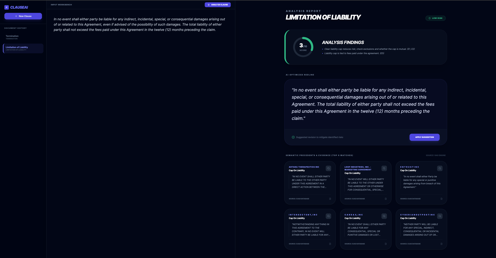
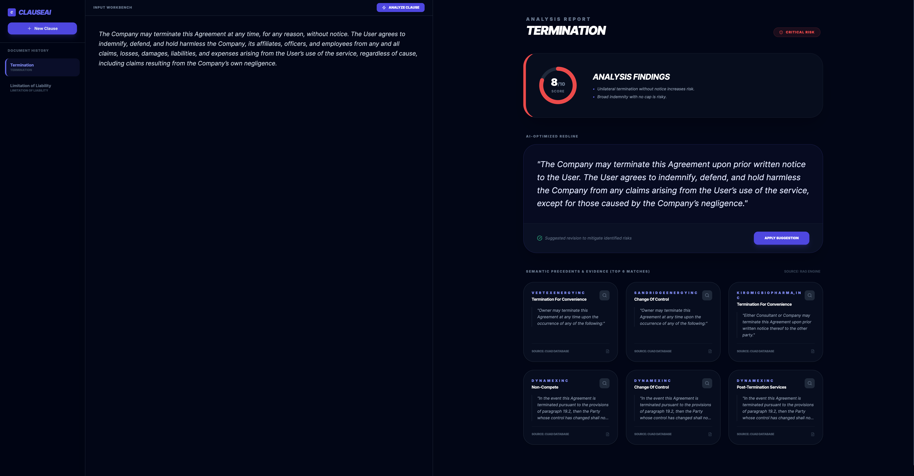

# ClauseAI
**LLM-Powered Legal Contract Analytics & Risk Quantification**

ClauseAI is a **production-ready, containerized full-stack system** for **interactive, clause-by-clause legal contract analysis** that combines local large language models (LLMs), sentence-level semantic embeddings, and **retrieval-augmented generation (RAG)** to assess contractual risk, explain legal implications, and suggest safer alternative language grounded in real precedents. The system leverages **[Llama 3.1 8B](https://www.llama.com/llama3_1/)** for high-capacity legal reasoning and the **[HuggingFace all-MiniLM-L6-v2](https://huggingface.co/sentence-transformers/all-MiniLM-L6-v2)** transformer model to generate dense clause embeddings, which are indexed using **FAISS** for efficient semantic retrieval over a corpus derived from the **[Contract Understanding Atticus Dataset (CUAD)](https://www.atticusprojectai.org/cuad)**. Retrieved clauses are incorporated into the LLM’s context via the RAG pipeline, ensuring that risk scores, explanations, and rewrite suggestions are evidence-backed and aligned with established contractual norms.


<p align="center">     </p>


## Demo UI

<p align="center"></p>
<p align="center"></p>


## Key Features

- **Clause-Level Risk Analysis**: Analyzes contracts at the individual clause level rather than treating an entire document as a single unit, enabling precise identification of risky provisions.

- **LLM-Guided Legal Reasoning**: Uses a local Llama 3.1 8B Instruct model to reason about legal obligations, asymmetry, liability exposure, and compliance risks in natural language.

- **Retrieval-Augmented Generation (RAG)**: Grounds model outputs in real contractual precedents by retrieving semantically similar clauses from the CUAD dataset using FAISS vector search.

- **Explainable Risk Scoring**: Produces a numeric risk score with human-readable justification, ensuring outputs are transparent and auditable rather than opaque model predictions.

- **Privacy-Preserving, Local Execution**: Runs entirely on local infrastructure via Ollama, ensuring sensitive legal data never leaves the user’s environment.

- **Interactive Workbench**: A specialized UI for legal professionals to analyze and compare document versions side-by-side.


## Project Structure

```
ClauseAI/
├── backend/                   # FastAPI Backend
│   ├── app/                   # Core application logic
│   │   ├── core/              # Config and shared utilities
│   │   ├── llm/               # Ollama integration & prompt logic
│   │   ├── rag/               # Retrieval-Augmented Generation logic
│   │   ├── schemas/           # Pydantic data models
│   │   └── main.py            # API entrypoint
│   ├── requirements.txt       # Python dependencies
│   └── Dockerfile             # Backend container definition
├── frontend/                  # React + Vite Frontend
│   ├── src/
│   │   ├── api/               # API client services
│   │   ├── components/        # Reusable UI components
│   │   ├── hooks/             # Custom React hooks
│   │   ├── App.jsx            # Root component
│   │   └── Workbench.jsx      # Main analysis interface
│   ├── nginx.conf             # Production web server config
│   └── Dockerfile             # Frontend container definition
└── compose.yaml               # Multi-container orchestration
```

## Installation & Setup

### Prerequisites
Ensure the following are installed:
- [Docker](https://www.docker.com/get-started/)
- [Git](https://git-scm.com/)
- [Ollama](https://ollama.com/)
### 1. Clone the Repository

```bash
git clone https://github.com/rrgaire/ClauseAI.git
cd ClauseAI
```


### 2. Environment Configuration
Create a .env file in the root directory:

```bash
OLLAMA_HOST=http://host.docker.internal:11434
LLM_MODEL=llama3.1:8b
```

### 3. Run with Docker Compose
```bash
docker compose up --build
```

The application will be accessible at http://localhost:80.

To stop:
```bash
docker compose down
```

## Development Workflow

### Frontend (React + Vite)

```bash
cd frontend
npm install
npm run dev
```

### Backend (FastAPI)

```bash
cd backend
pip install -r requirements.txt
uvicorn main:app --reload
```

## Acknowledgments
This project builds upon the amazing open-source work of:
- [Ollama](https://ollama.com/): For providing the local LLM runtime.
- [FAISS](https://ai.meta.com/tools/faiss/): Efficient similarity search
- [FastAPI](https://fastapi.tiangolo.com/): For the high-performance backend framework.
- [Meta Llama 3](https://www.llama.com/llama3_1/): For the foundational legal analysis model.
- [HuggingFace all-MiniLM-L6-v2](https://huggingface.co/sentence-transformers/all-MiniLM-L6-v2): Sentence-Transformer.
- [CUAD Dataset](https://www.atticusprojectai.org/cuad): Legal clause annotations for contract understanding.


## License
MIT License. Free for both personal and commercial use.